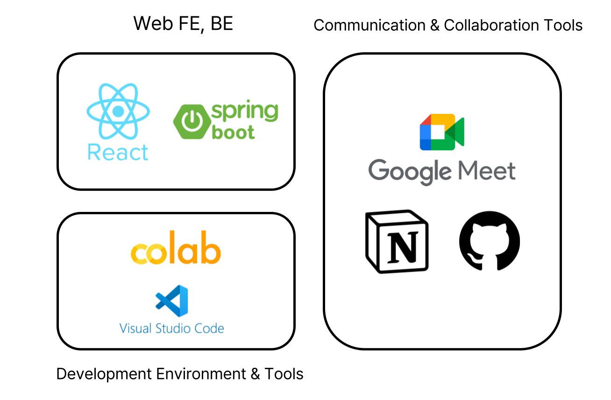

<<<<<<< HEAD
# SafePose

=======
>>>>>>> develop
# SafePose: 정신질환자의 낙상 사고 예방을 위한 AI 모니터링 시스템

SafePose는 정신질환자의 낙상 위험을 실시간으로 예측하고, 의료진 및 보호자에게 즉시 알림을 전송하는 AI 기반 행동 감지 시스템입니다.

---

## Contents

- [Project Overview](#Project-Overview)
- [Background](#Background)
- [Expected Outcomes](#Expected-Outcomes)
- [Key Features](#Key-Features)
- [Tech Stack](#Tech-Stack)
- [Contributors & Roles](#Contributors-&-Roles)
- [How to Contribute](#How-to-Contribute)
- [Usage](#Usage)

---

## Project Overview

SafePose는 정신병원 환경에서 발생하는 낙상 사고를 사전에 감지하기 위한 딥러닝 기반 시스템임.
낙상 징후가 탐지되면 즉시 알림을 전송하여 응급 상황을 예방하는 것을 목표로 함.

---

## Background

- 정신질환자는 약물 부작용, 인지 저하 등으로 인해 낙상 사고에 취약함
- 실제 정신병원 내 환자안전사고 중 낙상은 32.8%로 높은 비율을 차지
- 강박 해제 이후 근력 저하로 중증 낙상이 빈번하게 발생
- 인력 부족으로 실시간 모니터링이 어려운 실정
- AI 기반 실시간 움직임 분석 기술이 효과적인 대안이 될 수 있음

---

## Expected Outcomes

- 정신의료기관에 특화된 행동 인식 모델 구현
- 다양한 취약군 환경으로 기술 확장 가능
- 24시간 실시간 관찰 부담 경감 및 인력 활용 최적화
- 환자의 인권보호에 기여

---

## Key Features

1. 관절 움직임 기반 실시간 자세 추적
2. 딥러닝 기반 낙상 위험 판단
3. 위험 감지 시 실시간 알림 전송 (의료진/보호자)

---

## Tech Stack

---

## OpenSource Usage

1. Movenet(Google)
- https://github.com/tensorflow/docs-l10n/blob/master/site/ko/hub/tutorials/movenet.ipynb

---

## Contributors & Roles

- Eunseo Jeong : AI 모델 개발
- Seungji Kang : 실시간 알림 서비스 웹 구현
- Hyoju Lim : 데이터 수집 및 관절 추출 처리

---

## How to Contribute

1. main 브랜치에서는 배포 가능한 완성본만 포함하는 브랜치
2. develop 브랜치는 모든 기능 개발과 수정 작업이 진행
3. 이슈를 생성해 제안 및 버그 리포트
4. 새로운 기능은 Pull Request로 제안

---

## Usage

1. https://github.com/OpenSourceProgramming-S-H-E/SafePose.git
2. cd safepose
3. Spring Boot application 실행
4. 웹 브라우저에서 http://localhost:3001 접속

